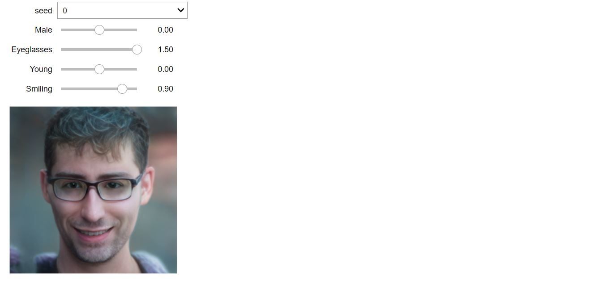
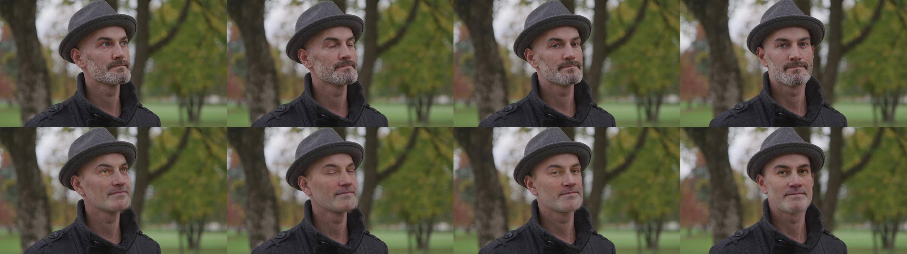

## A Latent Transformer for Disentangled Face Editing in Images and Videos

Official implementation for paper: A Latent Transformer for Disentangled Face Editing in Images and Videos. 

[[Video Editing Results]](https://drive.google.com/drive/folders/1aIfmbgJL1CUFgZQzqDVaUtLHrqxS6QjP?usp=sharing)

## Requirements

### Dependencies

- Python 3.6
- PyTorch 1.8
- Opencv
- Tensorboard_logger

You can install a new environment for this repo by running
```
conda env create -f environment.yml
conda activate lattrans 
```

### Prepare StyleGAN2 encoder and generator

* We use the pretrained StyleGAN2 encoder and generator released from paper [Encoding in Style: a StyleGAN Encoder for Image-to-Image Translation](https://arxiv.org/pdf/2008.00951.pdf). Download and save the [official implementation](https://github.com/eladrich/pixel2style2pixel.git) to `pixel2style2pixel/` directory. Download and save the [pretrained model](https://drive.google.com/file/d/1bMTNWkh5LArlaWSc_wa8VKyq2V42T2z0/view) to `pixel2style2pixel/pretrained_models/`.

* In order to save the latent codes to the designed path, we slightly modify `pixel2style2pixel/scripts/inference.py`.

    ```
    # modify run_on_batch()
    if opts.latent_mask is None:
        result_batch = net(inputs, randomize_noise=False, resize=opts.resize_outputs, return_latents=True)
        
    # modify run()
    tic = time.time()
    result_batch, latent_batch = run_on_batch(input_cuda, net, opts) 
    latent_save_path = os.path.join(test_opts.exp_dir, 'latent_code_%05d.npy'%global_i)
    np.save(latent_save_path, latent_batch.cpu().numpy())
    toc = time.time()
    ```


## Training

* Prepare the training data

    To train the latent transformers, you can download [our prepared dataset](https://drive.google.com/drive/folders/1aXVc-q2ER7A9aACSwml5Wyw5ZgrgPq52?usp=sharing) to the directory `data/` and the [pretrained latent classifier](https://drive.google.com/file/d/1K_ShWBfTOCbxBcJfzti7vlYGmRbjXTfn/view?usp=sharing) to the directory `models/`. 
    ```
    sh download.sh
    ```

    You can also prepare your own training data. To achieve that, you need to map your dataset to latent codes using the StyleGAN2 encoder. The corresponding label file is also required. You can continue to use our pretrained latent classifier. If you want to train your own latent classifier on new labels, you can use `pretraining/latent_classifier.py`. 

* Training

    You can modify the training options of the config file in the directory `configs/`.
    ```
    python train.py --config 001 
    ```

## Testing 

### Single Attribute Manipulation

Make sure that the latent classifier is downloaded to the directory `models/` and the StyleGAN2 encoder is prepared as required. After training your latent transformers, you can use `test.py` to run the latent transformer for the images in the test directory `data/test/`. We also provide several pretrained models [here](https://drive.google.com/file/d/14uipafI5mena7LFFtvPh6r5HdzjBqFEt/view?usp=sharing) (run ```download.sh``` to download them). The output images will be saved in the folder `outputs/`. You can change the desired attribute with `--attr`.

```
python test.py --config 001 --attr Eyeglasses --out_path ./outputs/
```
If you want to test the model on your custom images, you need to first encoder the images to the latent space of StyleGAN using the pretrained encoder.
```
cd pixel2style2pixel/
python scripts/inference.py \
--checkpoint_path=pretrained_models/psp_ffhq_encode.pt \
--data_path=../data/test/ \
--exp_dir=../data/test/ \
--test_batch_size=1
```

### Sequential Attribute Manipulation

You can reproduce the sequential editing results in the paper using `notebooks/figure_sequential_edit.ipynb` and the results in the supplementary material using `notebooks/figure_supplementary.ipynb`.



We also provide an interactive visualization `notebooks/visu_manipulation.ipynb`, where the user can choose the desired attributes for manipulation and define the magnitude of edit for each attribute.  


## Video Manipulation



We provide a script to achieve attribute manipulation for the videos in the test directory `data/video/`. Please ensure that the StyleGAN2 encoder is prepared as required. You can upload your own video and modify the options in `run_video_manip.sh`. You can view our [video editing results](https://drive.google.com/drive/folders/1aIfmbgJL1CUFgZQzqDVaUtLHrqxS6QjP?usp=sharing) presented in the paper.

```
sh run_video_manip.sh
```

## Citation
```
@article{yao2021latent,
  title={A Latent Transformer for Disentangled Face Editing in Images and Videos},
  author={Yao, Xu and Newson, Alasdair and Gousseau, Yann and Hellier, Pierre},
  journal={2021 International Conference on Computer Vision},
  year={2021}
}
```
## License

Copyright © 2021, InterDigital R&D France. All rights reserved.

This source code is made available under the license found in the LICENSE.txt in the root directory of this source tree.


